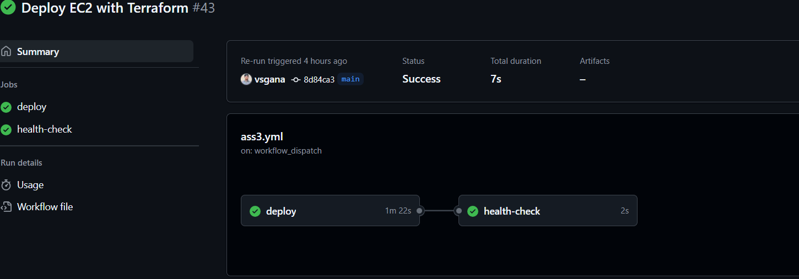

# EC2 Deployment with GitHub Actions and Terraform

This project automates the provisioning of AWS infrastructure using **Terraform**, triggered via **GitHub Actions**.

## 📦 Features

- Provision EC2 instances (`writer` and `reader`)
- Attach IAM instance profiles
- Store logs in an S3 bucket
- Auto-generate key pairs for SSH access
- Deploy app scripts using `user_data`
- Health check on Port 80 after deployment
- Triggered on:
  - Push to `main`
  - Tags `deploy-dev` or `deploy-prod`
  - Manual trigger via **GitHub Actions UI**

---

## 🚀 Deployment Flow

1. GitHub Action runs on:
   - Push to `main`
   - Push tag like `deploy-dev` or `deploy-prod`
   - Manual trigger via **workflow_dispatch**

2. Terraform:
   - Initializes the project
   - Applies infrastructure using `${stage}.tfvars`
   - Provisions two EC2 instances
   - Creates S3 bucket with lifecycle rules
   - Writes logs to S3
   - Generates dynamic SSH key pairs

3. Health check:
   - Polls the writer EC2 public IP
   - Verifies port 80 returns HTTP `200` (OK)

---

## 🛠 Manual Trigger Instructions

You can manually deploy using GitHub’s UI:

1. Go to **Actions → Deploy EC2 with Terraform**
2. Click **"Run workflow"**
3. Choose the environment:
   - `dev`
   - `prod`

---

## 🧪 Variables

Terraform uses different variable files depending on the stage:

- `dev.tfvars`
- `prod.tfvars`


---

## 🔐 Secrets Used

Add these in **GitHub > Settings > Secrets and Variables > Actions**:

| Secret Name             | Description              |
|-------------------------|--------------------------|
| `AWS_ACCESS_KEY_ID`     | Your AWS access key ID   |
| `AWS_SECRET_ACCESS_KEY` | Your AWS secret key      |

---
```bash
.
├── .github/workflows/
│   └── ass3.yml
├── main.tf
├── output.tf
├── iam.tf
├── dev.tfvars
├── prod.tfvars
└── scripts/
      └── scripts.sh
      └── reader.sh
```
deploy.yaml
```bash

name: Deploy EC2 with Terraform

on:
  push:
    branches: [automation2]
    tags:
      - deploy-dev
      - deploy-prod
  workflow_dispatch:
    inputs:
      stage:
        description: "dev or prod"
        required: true
        default: "dev"

jobs:
  deploy:
    runs-on: ubuntu-latest

    outputs:
      writer_ip: ${{ steps.get_ips.outputs.writer_ip }}
      reader_ip: ${{ steps.get_ips.outputs.reader_ip }}

    steps:
      - name: 📥 Checkout code
        uses: actions/checkout@v3

      - name: 🏷 Set STAGE variable
        run: |
          if [[ "${{ github.event_name }}" == "workflow_dispatch" ]]; then
            echo "STAGE=${{ github.event.inputs.stage }}" >> $GITHUB_ENV
          elif [[ "${{ github.ref }}" == "refs/tags/deploy-prod" ]]; then
            echo "STAGE=prod" >> $GITHUB_ENV
          else
            echo "STAGE=dev" >> $GITHUB_ENV
          fi

      - name: 🔐 Configure AWS Credentials
        uses: aws-actions/configure-aws-credentials@v2
        with:
          aws-access-key-id: ${{ secrets.AWS_ACCESS_KEY_ID }}
          aws-secret-access-key: ${{ secrets.AWS_SECRET_ACCESS_KEY }}
          aws-region: ap-south-1

      - name: 🔧 Setup Terraform
        uses: hashicorp/setup-terraform@v2

      - name: ⚙️ Terraform Init
        run: terraform init

      - name: 🚀 Terraform Apply
        run: terraform apply -auto-approve -var-file="${STAGE}.tfvars"

      - name: 📤 Get Terraform Outputs (Public IPs)
        id: get_ips
        run: |
          writer_ip=$(terraform output -raw writer_public_ip 2>/dev/null| grep -Eo '([0-9]{1,3}\.){3}[0-9]{1,3}' | head -n 1)
          reader_ip=$(terraform output -raw reader_public_ip 2>/dev/null| grep -Eo '([0-9]{1,3}\.){3}[0-9]{1,3}' | head -n 1)

          echo "writer_ip=$writer_ip" >> $GITHUB_OUTPUT
          echo "reader_ip=$reader_ip" >> $GITHUB_OUTPUT

          echo "Writer IP: $writer_ip"
          echo "Reader IP: $reader_ip"

  health-check:
    runs-on: ubuntu-latest
    needs: deploy
    steps:
      - name: 🔍 Health Check - Writer EC2 (Port 80)
        run: |
          WRITER_IP=${{ needs.deploy.outputs.writer_ip }}
          echo "Checking if port 80 is reachable on $WRITER_IP..."

          for i in {1..10}; do
            STATUS=$(curl -s --max-time 5 -o /dev/null -w "%{http_code}" http://$WRITER_IP)
            if [ "$STATUS" -eq 200 ]; then
              echo "✅ App is healthy and reachable (HTTP 200)"
              exit 0
            else
              echo "⏳ Attempt $i: Not ready yet (status: $STATUS). Retrying in 5s..."
              sleep 5
            fi
          done

          echo "❌ App is not reachable on port 80 after multiple attempts"
          exit 1
```
.


